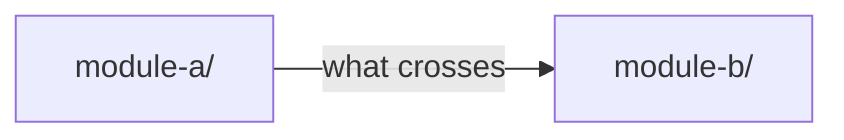

# Architecture

<State of the system as it stands. Present tense. No history — that is the worklog. No "this change" — that is a PR description. Getting started, testing, debugging, and release live in the root README; this file is shape and seams.>

## Diagram

<One picture of the shape above. Boxes are the components; arrows are what
crosses between them and by what mechanism. Draw only load-bearing edges — a
diagram of every call is a call graph, and nobody reads it.>

<Name a path the way you would in prose: a file with its extension, a directory
with a trailing slash. The `diagram-refs` check reads those and fails when one
stops existing, which is what keeps this picture from outliving the code.>

## Components

<One entry per process, service, or top-level package. For each: what it owns, what it must not do, what it talks to.>

### <component> — `<path/>`

- Owns: <the data or behavior it is the single authority for>
- Must not: <the things it is forbidden from doing, and why — `path` to what enforces it if anything does>
- Talks to: <other components, via what mechanism>

## Data flow

<How a request, job, or event moves through the components above. Point at the entry point and the exit. If there is more than one significant flow, one subsection each.>

## Boundaries

<Where the seams are. Which interfaces are load-bearing — other modules or external systems depend on them and changing them is a structural decision. Point at the file that defines each.>

| Interface | Defined in | Consumers | Change requires |
|---|---|---|---|
| <name> | `<path>` | <who depends on it> | Architecture Decision Record (ADR) |

## Invariants

<System-wide truths. Any change that breaks one needs an ADR before the code.>

- <invariant — enforced by `<path>` / not enforced, relied on by convention>

## Decisions

<Small decisions that do not warrant an ADR file but affect more than one module. One row each. Structural decisions live in `docs/decisions/`.>

| Decision | Rejected | Why | Reverse if |
|---|---|---|---|
| <chosen> | <alternative> | <reason> | <condition> |

## Known gaps

<What does not work, is not handled, or is known to be fragile. Specific: the condition, the consequence, and why it is not fixed.>

- <gap — `<path>` — not fixed because <reason>>
