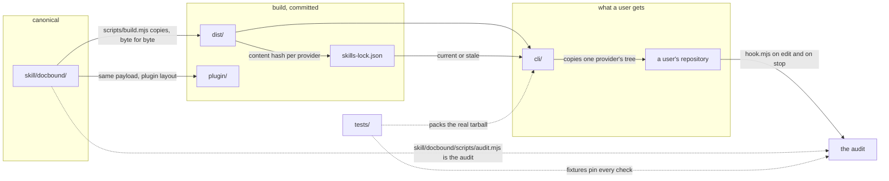

# Architecture

One skill, copied outward. Everything in this repository is either the canonical
skill, something that copies it somewhere, or something that checks that the
copy is faithful.

## Diagram

One skill copied outward, and one audit run over whatever repository it lands
in. The two flows share nothing but the payload.

Solid arrows are things that move; dotted arrows are things that check. The
build is the only writer of `dist/` and `plugin/`, and `cli/` is the only thing
that writes into a user's repository.

## Components

### skill — `skill/docbound/`

- Owns: the skill text, the reference prose, the templates, the audit, the
  scaffold, the hook, and the documenter agent definition.
- Must not: import anything outside itself, assume where it is installed, or
  gain a runtime dependency. It is copied verbatim into seven paths and may also
  be vendored by hand with nothing else present.
- Talks to: git, through `skill/docbound/scripts/lib/git.mjs`, and the
  filesystem below whichever root it is handed. Nothing else.

### build — `scripts/`

- Owns: `dist/`, `plugin/`, and `skills-lock.json`. Reads the provider table
  from `cli/providers.mjs`, which ships and therefore lives with the package.
- Must not: transform the payload, or read anything outside `skill/docbound/`
  when deciding what to emit. The build is a pure function of its input and
  `tests/build.test.mjs` asserts it.
- Talks to: the filesystem. It is the only writer of the three outputs above.

### cli — `cli/`

- Owns: what lands in a user's project, how an existing project's config
  survives an install, and the provider table.
- Must not: implement a check, or overwrite what the project already owns.
- Talks to: `cli/providers.mjs` for placement, `dist/` for the payload,
  `skills-lock.json` to tell current from stale, and the skill's scripts as
  subprocesses.

### tests — `tests/`

- Owns: the definition of correct behaviour for the check set.
- Must not: assert a subset of findings, or depend on the order fixtures run in.
- Talks to: the real executables, as subprocesses, against repositories it
  builds in temporary directories.

## Data flow

There are two, and they meet nowhere.

**Distribution.** `skill/docbound/` → `scripts/build.mjs` → the seven
directories under `dist/`, and `plugin/`, all committed → `cli/install.mjs`
copies one distribution into a user's project, or a submodule and a symlink put
the payload there directly, or the plugin marketplace reads `plugin/` from a
checkout.

**Audit.** A repository root → `skill/docbound/scripts/lib/changes.mjs` produces
a change set → each module in `skill/docbound/scripts/lib/checks/` adds findings
to a shared context → waivers from the worklog entry demote some of them →
`skill/docbound/scripts/lib/report.mjs` prints text or JSON and the exit code
says whether the task is done.

The audit is entered from four places, all of which reach the same function:
the agent running `skill/docbound/scripts/audit.mjs` directly, the hook on an
edit or a stop, `npx docbound audit`, and CI.

## Boundaries

| Interface | Defined in | Consumers | Change requires |
|---|---|---|---|
| Check IDs, levels, waiver grammar | `skill/docbound/scripts/lib/checks/` | Every repository that has ever written a waiver | Architecture Decision Record, and a deprecation path |
| Audit JSON: `root`, `git`, `changed`, `errors`, `warnings`, `waived` | `skill/docbound/scripts/lib/report.mjs` | The hook, the CLI, the test suite | Architecture Decision Record |
| Audit exit codes: 0 pass, 1 errors, 2 usage | `skill/docbound/scripts/audit.mjs` | CI, pre-commit hooks, the CLI | Architecture Decision Record |
| The check module contract, `{ id, level, run(ctx) }` | `skill/docbound/scripts/audit.mjs` | Every check module | Architecture Decision Record |
| Provider placement and hook manifests | `cli/providers.mjs` | The build and the CLI | Evidence from the harness itself, recorded in the entry |
| The npm `files` whitelist | `package.json` | Everyone who runs `npx docbound` | A passing `tests/package.test.mjs` |
| Fixture contract: a setup script and an expected-findings file | `tests/harness.mjs` | Every fixture | Nothing |

## Invariants

- One canonical source. `skill/docbound/` is the only place skill content is
  edited; `dist/` and `plugin/` are outputs, enforced by
  `scripts/check-dist-fresh.mjs` in CI.
- The build is deterministic. Same input, byte-identical output, no timestamps
  and no machine paths — enforced by `tests/build.test.mjs`.
- The skill payload is byte-identical across providers. Only placement and the
  hook manifest differ — enforced by `tests/build.test.mjs`.
- Zero runtime dependencies, anywhere. Not enforced by a check; enforced by
  `package.json` having no `dependencies` key and a reviewer noticing one appear.
- The hook emits findings and never the edited buffer. Enforced by
  construction in `skill/docbound/scripts/hook.mjs`, which is handed findings
  and has no access to file contents. Two checks quote a truncated line inside
  their own message; `skill/docbound/references/hooks.md` names them and the
  limits.
- The audit reads only below the root it is given.

## Decisions

Structural decisions are in `docs/decisions/`. Local ones are in the `Decisions`
table of the module README that owns them — `cli/README.md` and
`scripts/README.md` both have one.

| Decision | Rejected | Why | Reverse if |
|---|---|---|---|
| Fixtures assert exact check-ID counts | Assert a subset | A check firing where it should not is the failure mode a subset assertion cannot see | Counts start changing for reasons unrelated to behaviour |
| Tests run the executables as subprocesses | Import and call | Exit codes and argument parsing are the interface CI depends on, and importing skips both | The subprocess cost dominates the suite's runtime |
| Provider hooks are not installed in this repository | Wire a settings file here | A contributor's session should not be gated by tooling they did not ask for; CI is this repository's gate | Contributors start landing changes that CI catches and a hook would have caught first |

## Known gaps

- Only a harness can confirm a provider entry. `tests/cli.test.mjs` asserts the
  payload lands where the entry says, which does not make the entry right about
  the world — that is how the Cursor entry shipped wrong once. Both shipped
  entries were checked against the harness's own files, and everything else is
  a candidate in `docs/providers.md` rather than an entry here.
- Two implementations of the audit exist for one release. The Python under
  `skill/docbound/scripts/reference/` is frozen and unmaintained, and nothing
  automatically checks that the two still agree — the diff is run by hand, and
  `tests/fixtures/` is what actually pins behaviour.
- The `logic-touched` check strips comments with a line-based approximation, so
  a comment marker inside a string literal can be misread. It is a warning for
  that reason.
- The audit does not read this repository's own skill payload prose
  (`docs/decisions/0007-audit-exclude-config.md`), so a dead path inside
  `skill/docbound/SKILL.md` is not caught here. It is caught in any repository
  that installs the skill and audits.
